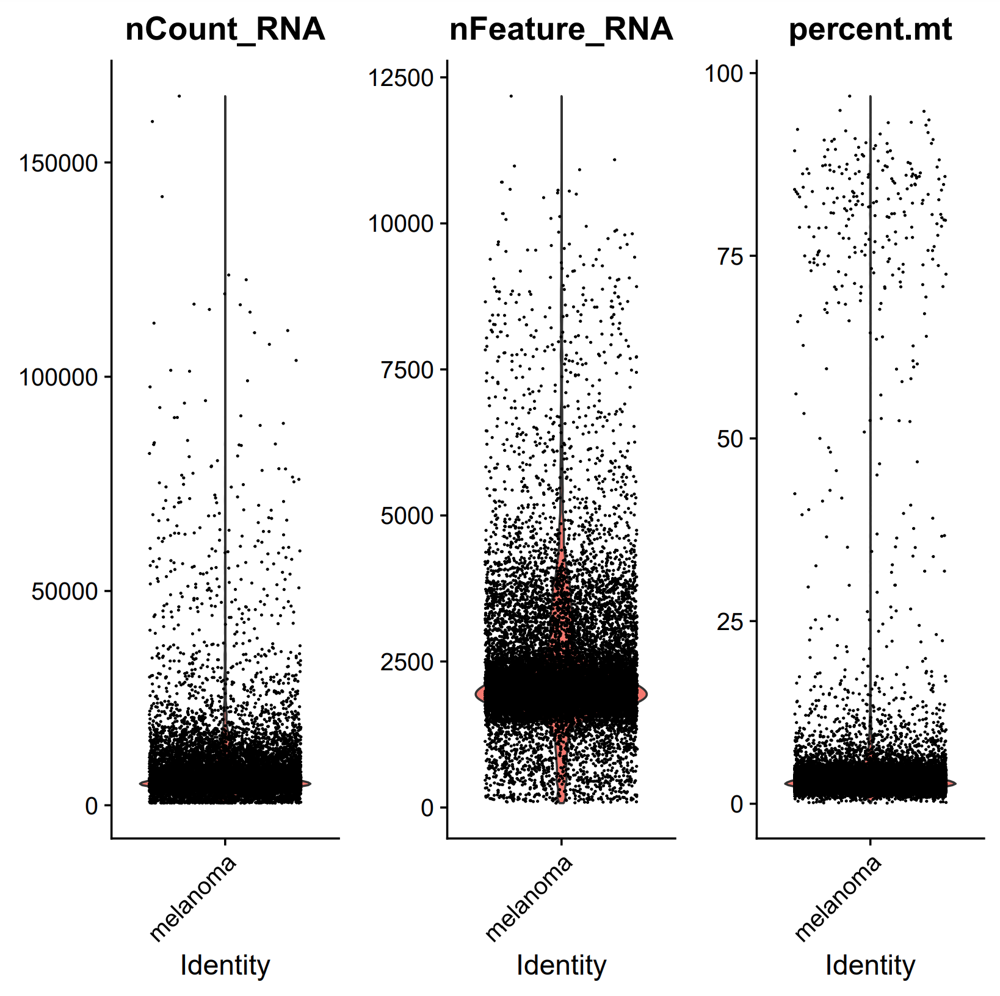

# Benchmarking scRNA Data Analysis (Using Scanpy and Seurat)

This is a Nextflow workflow for benchmarking the speed and resource usage of common scRNA data analysis steps 
using two scRNA analysis packages: [Seurat](https://satijalab.org/seurat/), which is based in R, 
and [Scanpy](https://scanpy.readthedocs.io/), which is based in Python.  In addition to the benchmarks, the workflow 
also outputs the results of the scRNA analysis in the form of plots depicting cell clusters and cell type annotations. 

## Project Goal
The goal of this project is to compare the speed, resource usage, and analysis results of Scanpy vs Seurat, on the same dataset(s).
This information would provide a second opinion in terms of scRNA analysis and allow one to determine the level of consensus between the two packages. 
Also, it could ultimately inform a decision regarding which package is most appropriate for individual use cases based on different datasets.

## scRNA Analysis Steps
The primary data processing steps benchmarked for both Seurat and Scanpy include: 
* Reading Input Data
* Quality Control
* Normalization
* Feature Selection
* PCA/Dimensionality Reduction
* UMAP
* Clustering
* Doublet Detection
* Automated Cell Type Annotation

## Dependencies
The pipeline has built-in Docker and Singularity support. Dependencies are handled using Docker containers, which are publicly available on 
Docker Hub at `dzezy/scanpy_benchmark` and `dzezy/seurat_benchmark`. Individual dependencies for these containers are also listed below. 

### Scanpy Container
* scanpy (1.10.2)
* python-igraph (0.11.6)
* leidenalg (0.10.2)
* scikit-image (0.24.0)
* celltypist (1.6.3)
* decoupler-py (1.8.0)
* matplotlib-base (3.9.2)

### Seurat Container
* seurat (5.1.0)
* R (4.3.3)
* tidyverse (2.0.0)
* hdf5r (1.3.11)
* viridis (0.6.5)
* pheatmap (1.0.12)
* remotes (2.5.0)
* singler (2.4.0)
* celldex (1.12.0)
* [DoubletFinder](https://github.com/chris-mcginnis-ucsf/DoubletFinder/)

## Usage Instructions
The workflow uses feature-barcode matrices (in .h5 format) as input data, and runs both Seurat and Scanpy 
scripts on the data. It is also capable of processing multiple input samples in parallel. 

### Getting Started
1. Clone the git repo into your local environment and cd into it.  
   `git clone https://github.com/dzezy/scRNA_benchmark.git && cd scRNA_benchmark`
2. Specify in `nextflow.config` the desired input directory for your input .h5 files (default: `$projectDir/input_h5`). Download all the .h5 files into this directory.
   Also, specify the desired output directory in `nextflow.config` (default: `$projectDir/results`)
3. Make sure conda and nextflow are accessible in your PATH. Run either of the following commands to start the workflow, depending on whether you are using Docker or Singularity:  
   `nextflow run main.nf -profile docker`  
   `nextflow run main.nf -profile singularity`

The output files, consisting of benchmark .log files and plot .pdf files for both Seurat and Scanpy, will be generated for each sample and published in the specified output directory.

### Customization
* To make running the pipeline easier, configure `run.sh` for your own paths and environments
* For specific analysis needs, adjust the generalized QC/analysis parameters at the top of the Seurat and Scanpy scripts in `scripts/`
* Also, you can modify the scripts if you want to benchmark other R and/or Python-based scRNA tools besides the ones used in this project.

## Example Output
The workflow outputs task-level speed benchmarks for both Seurat and Scanpy; examples of these benchmark .log files can be found in `example_benchmarks/`. 

The workflow also outputs one .html report file per workflow execution, stored in `pipeline_reports/`. These reports 
provide key performance metrics for each script execution, including CPU usage, memory usage, and job duration, as shown below. 

The pipeline also generates .pdf files containing an assortment of plots that depict QC metrics, cell clustering/annotation results, 
as well as other information pertaining to the analysis and how it was derived.  

Examples of some (not all) of the plots generated are shown below. The following plots were generated from this publicly available 10X dataset: `https://www.10xgenomics.com/datasets/10k-human-dtc-melanoma-NextGEM`

### Example Scanpy Plots

### Example Seurat Plots

## License
Distributed under the MIT License. See `LICENSE.txt` for more information.

